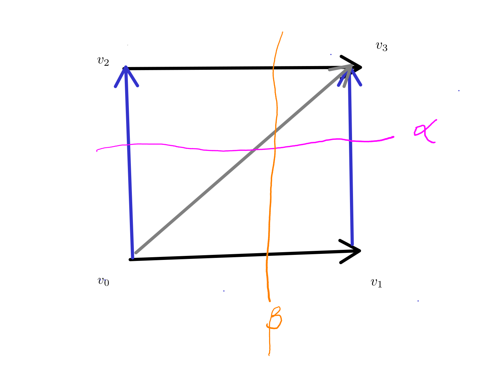
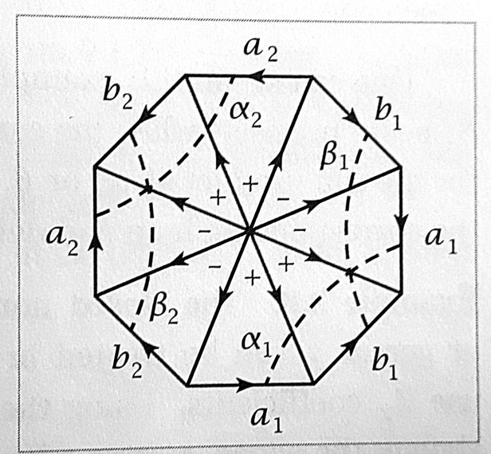

+++
title= "Cohomology - Geometry and Cup products"
date=2020-03-28
+++

#### Pairing and Universal coefficients

We can interpret the universal coefficients theorem as a pairing `$H^k \times H_k \to \mathbb{Z}$` which is non-degenerate up to torsion.

* __*__ Observe that if $A$ is a free abelian group, then `$Ext^1(A, M)$` vanishes, as `$0\to A \to A$` is a free resolution of `$A$`.
* __*__ In general, for a finitely generated abelian group, we get `$Ext^1(A, \mathbb{Z})$` is the torsion of $A$; as we get a free resolution of the form `$$0 \to F_k \to F_n \to A$$` with a diagonal homomorphism.
* __*__ In particular, `$H^1(X) = Hom(H_1(X), \mathbb{Z})$`.

### Singular and cellular cohomology

* __*__ Given a space $X$, the singular cohomology is the cohomology of the singular chain complex.
* __*__ Given a CW complex $X$, the cellular cohomology is the cohomology of the cellular chain complex; this is naturally isomorphic to singular cohomology.
* __*__ These are co-functors.
* __*__ We can define relative versions.
* __*__ Excision, exactness, dimension and homotopy continue to hold 
* __*__ Compact support does not hold, i.e., it is _not_ true that given a cohomology class, there is a cocycle `$\xi$` representing this so that there is a compact set $K$ such that if `$\sigma$` is a singular simplex with image disjoint from $K$, then `$\xi(\sigma) = 0$`.

### Geometry of cohomology

* __*__ We assign weights to edges that intersect given (unions of) arcs and curves.
* __*__ __Co-cycles:__ transversal arcs/surfaces etc match in simplices one dimension higher.

### $\Delta$-Complexes and Simplicial Cohomology

A `$\Delta$`-complex is like a CW-complex except

* __*__ cells are given by characteristic maps `$\sigma: \Delta^n \to X$` where `$\Delta^n$` is a simplex.
* __*__ the restrictions of `$\sigma$` to faces are also characteristic maps.
* __*__ We can define simplicial homology in this context.

### Cup product

* __*__ __Motivation:__ `$H^k(X)\times H^l(X) \to H^{k+l}(X \times X)\overset{\Delta^*}\to H^{k+l}(X)$`.

#### Definition of cup product

* __*__ Fix $X$ and let `$\alpha\in C^k(X)$` and `$\beta\in C^l(X)$`. Let $n= k + l$.
* __*__ We define for `$\sigma:<v_0, v_1,\dots, v_{k+l}> \to X$`,
`$$\alpha\cup \beta(\sigma) = \alpha(\sigma|_{<v_0, \dots, v_k>})\beta(\sigma|_{<v_k, \dots, v_{k+l}>})$$`.
* __*__ The same definition works for simplicial homology of `$\Delta$`-complexes.

#### Cup product on cohomology

* __*__ `$\delta (\varphi\cup \psi) = (\delta\varphi)\cup \psi+ (-1)^k\varphi\cup\delta\psi$`; conclude well-defined on cohomology.
* __*__ Thus, cohomology is a ring.

__Theorem:__ We have the relation
`$$\varphi\cup \psi = (-1)^{kl}\psi\cup\varphi$$` in cohomology.
