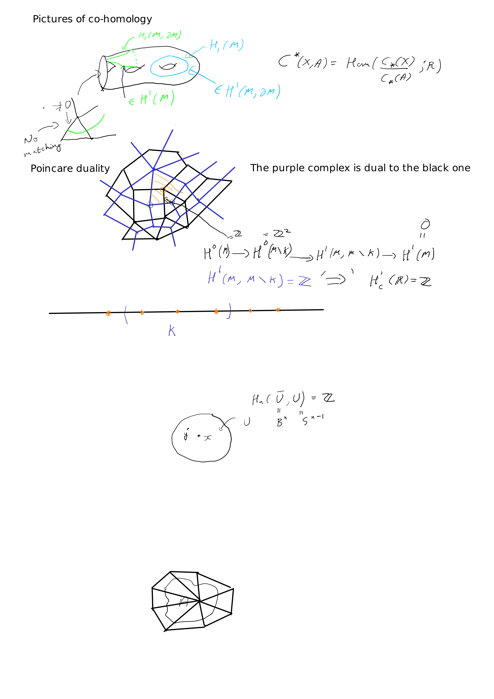
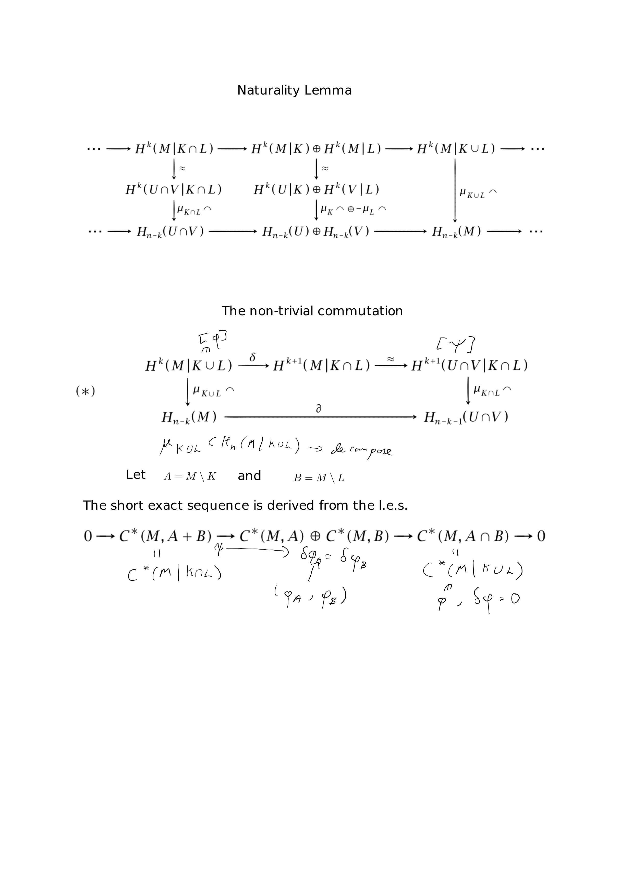

+++
title="Poincare duality"
date=2020-03-31
+++

#### Cup products: relative,  manifolds with boundary

* __*__ Relative cochains `$C^*(X, A)$` are cochains that _vanish_ on $A$.
* __*__ For manifolds with boundary, there is no co-cycle condition at the boundary, so co-chains are _similar to_ properly embedded submanifolds with boundary.
* __*__ On the other hand, _relative_ co-cycles correspond to closed manifolds.

#### Geometry of Poincar&eacute; duality

* __*__ Given a cell decomposition of an oriented $n$-dimensional manifold $M$, we can construct a _dual_ cell decomposition.
* __*__ The cellular chain complex for the dual cell decomposition is the cellular cochain complex of the original cell decomposition.
* __*__ Hence we get `$$H^k(M) = H_{n- k}(M)$$`
* __*__ For manifolds with boundary, we have corresponding statements:
`$$H^k(M, \partial M) = H_{n- k}(M) \\
H^k(M) = H_{n- k}(M, \partial M) $$`

#### Local homology, _restricting_ homology

* __*__ Fix a space $M$.
* __*__ The local homology at a point is `$H_*(M, M\setminus\{x\})$`.
* __*__ By excision, `$H_*(M, M\setminus\{x\}) = H_*(U, U\setminus\{x\})$` if $U$ is open and `$x \in U$`.
* __*__ In particular if $M$ is a manifold we know the local homology.
* __*__ More generally, for `$A \subset M$` we define `$H_*(M\vert A) = H_*(M, M\setminus A). $`
* __*__ By excision, if $A$ is closed, `$U\subset M$` is open and `$A \subset U$`, then `$H_*(M\vert A) = H_*(U\vert A)$`.
* __*__ This is _contravariant_ in $A$, with restriction; similarly cohomology restricted to $A$ is _covariant_.
* __*__ WE can similarly define cohomology at $A$, and this is _covariant_.

#### Cohomology with compact support

* __*__ Assume $M$ has an exhaustion by compact sets (true for manifolds).
* __*__ Define `$H^*_c(M) = \lim H^*(M, M\setminus K)$` with respect to the ordering of compact sets by inclusions.
* __*__ In the case where $M$ is compact, this is just the ordinary cohomology, but not for $\mathbb{R}$.

#### Orientations and the Fundamental class

* __*__ Let $M$ be a connected $n$-dimensional manifold.
* __*__ Poincar&eacute; duality would imply `$H_n(M; \mathbb{Z}) = H_0(M, \mathbb{Z})= \mathbb{Z}$`.
* __*__ For a ring $R$ we define the orientation cover.
* __*__ We consider the rings `$\mathbb{Z}$` and `$\mathbb{Z}/2$`.
* __*__ A local orientation is a choice of generator `$\mu_x\in H_*(M\vert x)$` for each `$x\in M$`, which is locally constant, i.e., for `$x\in M$` there is an open neighbourhood $U$ of $x$ with closure homeomorphic to a ball such that there exists a generator `$\mu_U \in H_n(\bar{U}, \partial U) = \mathbb{Z}$` such that for all `$y\in U$`, `$\mu_y$` is the image of `$\mu_U$`.
* __*__ We say $M$ is _oriented_ if $M$ has a local orientation at each point.
* __*__ __Theorem:__ If $M$ is closed and $R$-oriented, then `$H_n(M; R)= R$` and `$H_k(M, R) = 0$` for $k > n$.
* __*__ We work inductively, so we want a statement for non-compact manifolds.
* __*__ __Lemma:__ Let $M$ be a connected $n$-dimensional manifold and $A\subset M$ be compact.
    * __*__ (a) `$H_i(M\vert A; R) = 0$` if $i > n$ and a class $z\in H_n(M\vert A; R)$ is zero if and only if its image is zero in each `$H_n(M\vert x; R)$`.
    * __*__ (b) Given a local orientation `$\mu_x$` there is a class `$\mu\in H_n(M\vert A; R)$` that restricts to `$\mu_x$` for all `$x\in A$`.
* __*__ We work inductively, using
`$$0 \to H_n(M\vert A\cup B)\to H_N(M\vert A)\oplus H_n(M\vert B)\to H_n(M\vert A\cap B)$$`
to conclude that if the result holds for $A$, $B$ and `$A \cap B$` then it holds for `$A \cup B$`.
* __*__ For a class in `$H_n(M\vert A \cup B)$` we chase the diagram.
* __*__ Given a local orientation, find classes `$\mu_A\in H_n(M\vert A)$` and `$\mu_B\in H_n(M\vert B)$` satisfying the conclusion, and observe `$(\mu_A, \mu_B)$` maps to zero, and use exactness.
* __*__ Using this, we can reduce to the case where `$M = \mathbb{R}^n$`.
* __*__ Can deduce for $A$ a linear simplex.
* __*__ Hence deduce for a union of simplices.
* __*__ For a general $A$ in `$\mathbb{R^n}$`, we upper bound by a union of simplices so that each simplex intersects $A$.
* __*__ The generator `$\mu\in H_n(M; R)$` we obtain in the compact case is called the _fundamental class_ and denoted `$[M]$`.

#### Cap product

* __*__ `$\cap: C_k(X; R) \times C^l(X; R)\to C_{k-l}(X; R)$` is given by 
`$$\sigma\cap \varphi = \varphi(\sigma\vert_{<v_0, \dots, v_l>})\sigma\vert_{<v_l, \dots, v_k>}$$`
* __*__ We have `$\partial (\sigma\cap\varphi) = (-1)^l(\partial \sigma\cap \varphi - \sigma\cap\delta\varphi)$`, hence induces pairing on homology and cohomology.
* __*__ In fact, we get
`$$H_k(X, A;R)\times H^l(X; R)\to H_{k -l}(X, A; R),\\
H_k(X, A;R)\times H^l(X, A; R)\to H_{k -l}(X; R).$$`
* __*__ Further, `$\psi(\sigma\cap \varphi)= (\psi\cup\varphi)(\sigma)$` if `$\sigma \in H_k(M)$`, `$\varphi\in H^l(M)$` and `$\psi\in H^{k-l}(M)$`.

#### Poincar&eacute; duality

* __*__ The statement of Poincar&eacute; duality is in fact that the cap product with the fundamental class is an isomorphism, i.e.,
`$D_M : H^k(M) \to H_{n-k}(M)$` given by `$\varphi \mapsto [M]\cap \varphi$` is an isomorphism.
* __*__ For (in general) non-compact, $R$-oriented manifold, let `$D_M: H_c^k(M; R)\to H_{n- k}(M; R)$` be the limit of cap products with fundamental class.
* __*__ We see `$$D_M: H_c^k(M; R) \overset{\cong}\to H_{n- k}(M; R).$$`
* __*__ This follows inductively.
* __*__ We use maps `$D_M: H^k(M, M\setminus K)\to H_{n-k}(M)$`.
